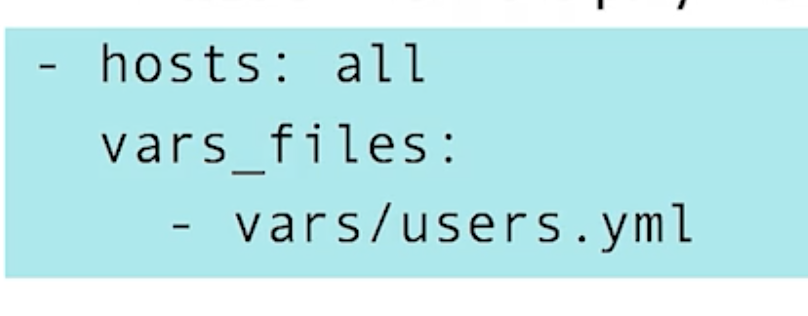
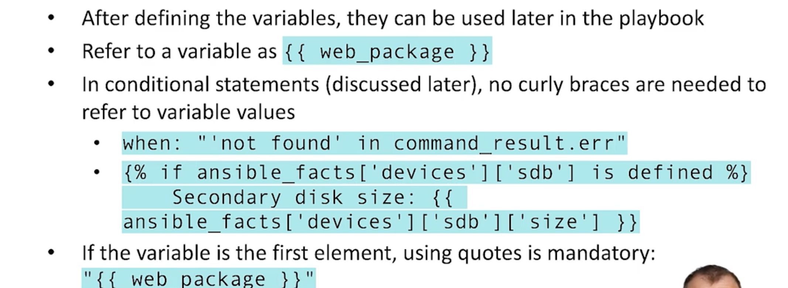

# RHCE Preparation Notes

## Lessons

## Lesson 1: [Topic Name]
**Objectives:**
- 
- 

**Key Concepts:**
- 

**Commands & Examples:**
```bash

```

**Lab 1:**
**Task:**
**Solution:**

## Lesson 2: [Topic Name]
**Objectives:**
- 
- 

**Key Concepts:**
- 

**Commands & Examples:**
```bash

```

**Lab 2:**
**Task:**
**Solution:**

## Lesson 3: [Topic Name]
**Objectives:**
- 
- 

**Key Concepts:**
- 

**Commands & Examples:**
```bash

```

**Lab 3:**
**Task:**
**Solution:**

## Lesson 4: [Topic Name]
**Objectives:**
- 
- 

**Key Concepts:**
- 

**Commands & Examples:**
```bash

```

**Lab 4:**
**Task:**
**Solution:**

## Lesson 5: Using Variables
**Objectives:**
- Including group, host, and system vars in playbooks
- Manage sensitive values using Ansible Vault

**Key Concepts:**
- When referencing variables, use double curly braces {{ var }} EXCEPT in conditionals
- Use vars_files, not playbook defined variables
- By default, Ansible looks in /vars for variable files so you can refer to /vars/users in a playbook as just "users"
- If you don't specifically refer to a vars_file in a playbook, the default behavior is to check for host_vars and/or group_vars
- Ansible variable references {{ var }} must be double-quoted if they start a YAML value to prevent parser errors, while they should be unquoted in conditional statements (when, failed_when). Always quote if the variable is part of a larger string (e.g., "/path/{{ file }}") or contains special characters to ensure correct Jinja2 rendering

**Commands & Examples:**

Refer to variable file

Referencing variables in and out of conditionals

Ansible Vault

Create a vault encrypted file containing variables:
```bash
ansible-vault create usernames
``` 

Ansible Vault password file should NOT be version controlled

Example of running a playbook using vault secrets:
```bash
ansible-playbook --vault-password-file=/path/to/vaultpw lab5.yml
```

**Lab 5:**

**Task:**
1. Create a user and password using vault encrypted variables

**Solution:**
```bash
---
- name: Create a user using variables from files and vault encryption
  hosts: node2
  vars_files:
    - /etc/ansible/vars/lab5/user
    - /etc/ansible/vars/lab5/pw
  become: true
  tasks:
    - name: Create user named {{ user }}
      user: 
        name: "{{ user }}"
    - name: Generate and set encrypted password
      shell: echo {{ pw }} | passwd --stdin {{ user }}
    - name: Show User info
      debug:
        msg: Password for user {{ user }} has been set to {{ pw }}
```

---

## Lesson 6: [Topic Name]
**Objectives:**
-
- 

**Key Concepts:**
- 

**Commands & Examples:**
```bash

```

**Lab 6:**
**Task:**
**Solution:**

## Lesson 7: [Topic Name]
**Objectives:**
- 
- 

**Key Concepts:**
- 

**Commands & Examples:**
```bash

```

**Lab 7:**
**Task:**
**Solution:**

## Lesson 8: [Topic Name]
**Objectives:**
- 
- 

**Key Concepts:**
- 

**Commands & Examples:**
```bash

```

**Lab 8:**
**Task:**
**Solution:**

## Lesson 9: [Topic Name]
**Objectives:**
- 
- 

**Key Concepts:**
- 

**Commands & Examples:**
```bash

```

**Lab 9:**
**Task:**
**Solution:**

## Lesson 10: [Topic Name]
**Objectives:**
- 
- 

**Key Concepts:**
- 

**Commands & Examples:**
```bash

```

**Lab 10:**
**Task:**
**Solution:**

## Lesson 11: [Topic Name]
**Objectives:**
- 
- 

**Key Concepts:**
- 

**Commands & Examples:**
```bash

```

**Lab 11:**
**Task:**
**Solution:**

## Lesson 12: [Topic Name]
**Objectives:**
- 
- 

**Key Concepts:**
- 

**Commands & Examples:**
```bash

```

**Lab 12:**
**Task:**
**Solution:**

## Lesson 13: [Topic Name]
**Objectives:**
- 
- 

**Key Concepts:**
- 

**Commands & Examples:**
```bash

```

**Lab 13:**
**Task:**
**Solution:**

## Lesson 14: [Topic Name]
**Objectives:**
- 
- 

**Key Concepts:**
- 

**Commands & Examples:**
```bash

```

**Lab 14:**
**Task:**
**Solution:**

## Lesson 15: [Topic Name]
**Objectives:**
- 
- 

**Key Concepts:**
- 

**Commands & Examples:**
```bash

```

**Lab 15:**
**Task:**
**Solution:**

## Lesson 16: [Topic Name]
**Objectives:**
- 
- 

**Key Concepts:**
- 

**Commands & Examples:**
```bash

```

**Lab 16:**
**Task:**
**Solution:**

## Practical Exam

**Exam Format:**
**Time Limit:**
**Passing Score:**

### Practice Scenarios

#### Scenario 1: [Name]
**Requirements:**
**Solution:**
**Verification:**

#### Scenario 2-N: [Repeat above]

### Review Checklist
- [ ] 
- [ ] 
- [ ] 

---

## Study Progress
Lesson 1-5: [X] Complete
Lesson 6-11: [ ] Complete
Lesson 12-16: [ ] Complete
Exam Prep: [ ] Complete
